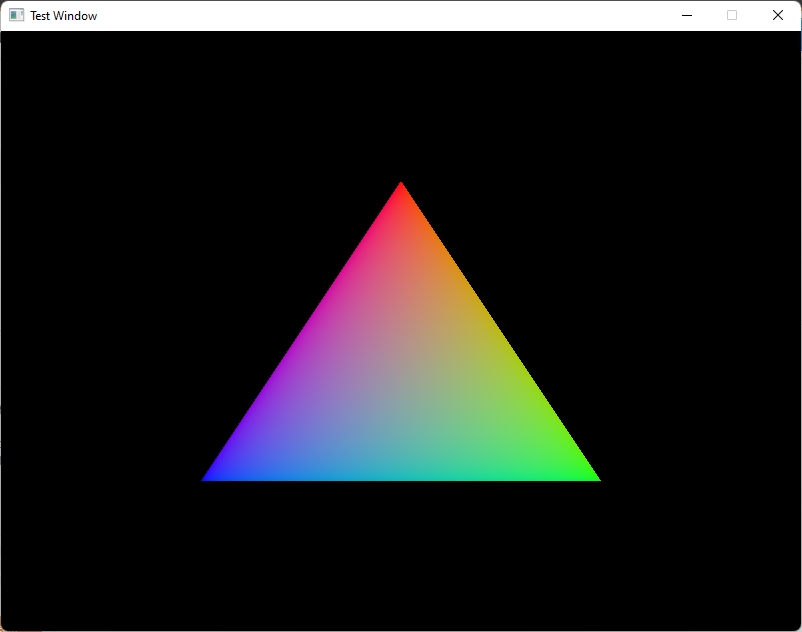
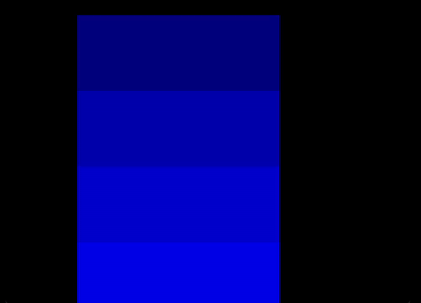
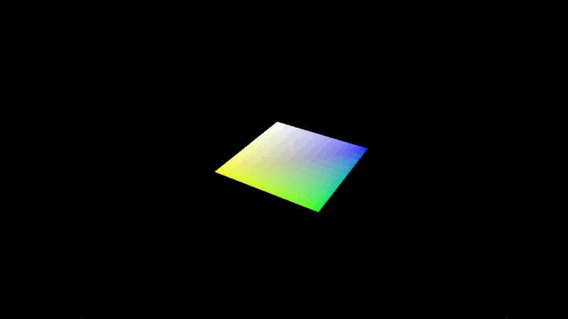
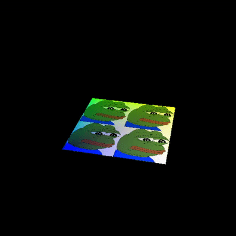
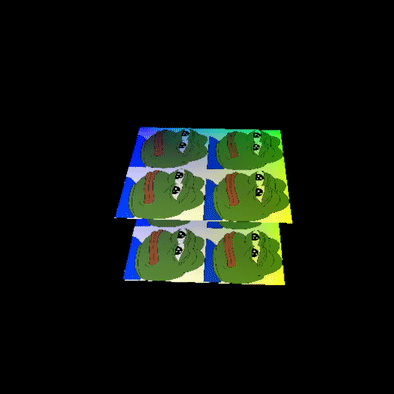
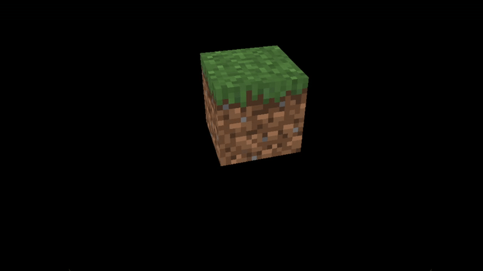

# ESP32 Vulkan

## Content

[[_TOC_]]

## Team member

- Minh Dang
- Son Nguyen

## Pinout

|Name|Pin|Name|Pin|
|:---:|:---:|:---:|:---:|
|ESP32|D23|BNO055|SCL|
|ESP32|D21|BNO055|SCA|

## MD Vulkan renderer

[MD-Vulkan-Renderer](https://github.com/minhdangphuoc/MD-Vulkan-Renderer)

## Changelog

- `5th May`: Hardware testing - checking esp32 and BNO32
- `6th May`: Add Vk Renderer repo to Project repo, Add functions into renderer - [More details in this link](https://github.com/minhdangphuoc/MD-Vulkan-Renderer/tree/feature/0.0.2)
- `9th May`: Research and develop BLE - primary data transfering method between ESP32 and client.
- `10th May`: Develop BLE Client and ESP32 BLE Server
- `11th May`: Testing connection between BLE-CLI-Client and ESP32. Create a prototype idea about hardware case design.
- `12th May`: Develop Vulkan Renderer - Rendering pipeline
- `13th May`: Develop Vulkan Renderer - Rendering triangle
- `16th May`: Finished rendering triangle and research BLE transmission.
- `17th May`: Fixed clean up function for Post-rendering.
- `18th May`: Swapchain Recreation
- `19th May`: add vertex buffer for renderer
- `20th May`: add staging buffer
- `23th May`: add index buffer, copies and motion
- `24th May`: add gameObject Class
- `25th May`: 2D Rotation, project building system and controller data communication
- `27th May`: 3D case design research, add BLE into VK Renderer
- `30th May`: Seperate MD Engine and ESP32 Projects 
- `31th May`: Clean old code, downgrade 
- `1st June`:  
- `2nd June`: Add Uniform buffer
- `3rd June`: Continue Uniform buffer
- `6th June`: Finish and test Uniform buffer 
- `7th June`: Add Texture Mapping 
- `8th June`: Continue Texture Mapping  
- `9th June`: Continue Texture Mapping 
- `10th June`: Finish and test Texture Mapping 
- `13th June`: Create texture demo and make a copy textures and shaders into build dir script - CMake
- `14th June`: Add Depth Buffering
- `15th June`: Finished Depth Buffering
- `16th June`: Add and finish rendering 3D model

## Roadmap

- [+ 0.0.1 - Add VkRenderer git module +]
- [+ 0.0.2 - BLE-CLI-Client and BLE-ESP32-Server +]
- [+ 0.0.3 - Rendering functionality in Vulkan Renderer, static image +]
- [+ 0.0.4 - Rendering functionality in Vulkan Renderer, recreate swapchain +]
- [+ 0.1.0 - Renderer in Vulkan Renderer, simple triangle +]
- [+ 0.1.1 - Vertex input description and Vertex buffer creation +]
- [+ 0.1.2 - Index and Staging buffers +]
- [+ 0.1.3 - Copies and Motion +]
- [+ 0.2.1 - 2D Rotation +]

... //to-do

## Issues

- [x] vkCreateSwapchainKHR() return message "Cannot accessing address" when using NVI GPU -> Downgrade NVI Driver

## Screenshot

### Triangle

## Third-party API

- [SimpleBLE](https://github.com/OpenBluetoothToolbox/SimpleBLE)
- [STB](https://github.com/nothings/stb)
- [TinyOBJLoader](https://github.com/tinyobjloader/tinyobjloader)
- [GLM](https://github.com/g-truc/glm)
- [GLFW](https://github.com/glfw/glfw)

